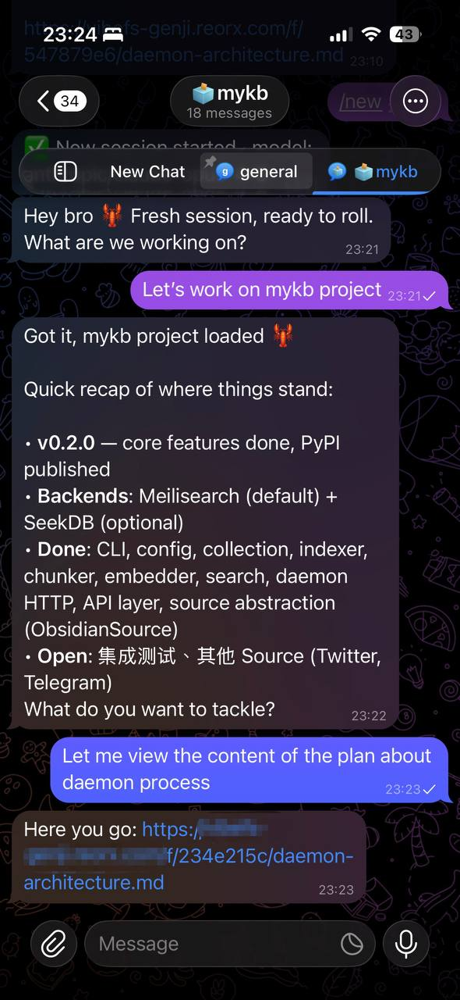
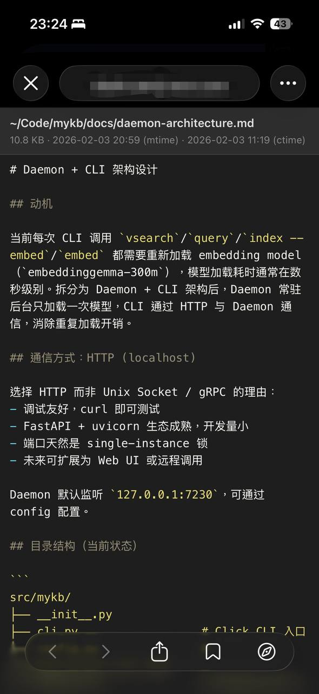

# vibefs

A file and directory preview server with time-limited access control, designed for AI agents to share local files with users via URLs.

Files and directories are not accessible by default. Each must be explicitly authorized with a TTL. The server starts automatically on the first `allow` call and shuts down when all authorizations expire.

| Agent interaction | File preview |
|:---:|:---:|
|  |  |

## Install

With [uv](https://docs.astral.sh/uv/):

```bash
# Install globally
uv tool install vibefs

# Or run directly without installing
uvx vibefs --help
```

## Usage

### Share a file

```bash
vibefs allow /path/to/file.py
# http://localhost:17173/f/a3b7c2d1/file.py

vibefs allow /path/to/file.py --ttl 300    # 5 minutes
vibefs allow /path/to/file.py --head 50    # Only first 50 lines
vibefs allow /path/to/file.py --tail 20    # Only last 20 lines
vibefs allow /path/to/file.py --live       # Auto-refresh on file changes
vibefs allow /path/to/file.py --json       # Output URL as JSON
```

The daemon starts automatically if it's not already running.

### Share a directory

```bash
vibefs allow ~/project/
# http://localhost:17173/d/a3b7c2d1e5f6

vibefs allow ~/project/ --ttl 7200               # 2 hours (default: 3 hours)
vibefs allow ~/project/ --exclude '*.log'         # Exclude log files
vibefs allow ~/project/ --live                    # Auto-refresh on changes
```

Directory shares provide a browsable UI with a sidebar file tree and preview pane. Supports:
- Code files with syntax highlighting
- Markdown rendered as formatted HTML
- Images displayed inline
- CSV/TSV as styled tables
- PDF, SVG, audio, and video preview
- Files >5MB served as download
- File search within the directory
- Deep linking: `/d/<token>/path/to/file` opens with that file selected

Default excludes: `.git/`, `__pycache__/`, `.env`, `node_modules/`, `.DS_Store`, `*.pyc`, `.venv/`

### Share content from stdin

```bash
echo "# Hello" | vibefs share --type markdown
git diff | vibefs share --type diff --title "my changes"
vibefs share --content "print('hi')" --type python
cat data.csv | vibefs share --type text --ttl 7200
```

Supported types: `markdown`, `python`, `javascript`, `json`, `yaml`, `html`, `css`, `shell`, `diff`, `code`, `text`

### Share a git commit

```bash
vibefs allow-git /path/to/repo abc1234
vibefs allow-git . HEAD              # Current commit in current repo
vibefs allow-git . HEAD --ttl 300
```

Renders commit metadata, file list, and expandable diffs with syntax highlighting.

### Manage shares

```bash
vibefs list                  # List all active shares
vibefs list --json           # Output as JSON array
vibefs revoke <token>        # Revoke a specific share
```

### Owner dashboard

```bash
vibefs owner-url             # Print dashboard URL with auto-generated key
```

The dashboard shows all shares (files, directories, git commits) and lets you manage them. Authentication uses an auto-generated 32-char key — visit the URL once to set a 30-day cookie, then `/dashboard` works without the key.

### Server control

```bash
vibefs status                # Check if daemon is running
vibefs status --json         # Output as JSON
vibefs stop                  # Stop the daemon
vibefs serve                 # Start server in foreground (for debugging)
vibefs serve --tunnel        # Start with a Cloudflare Quick Tunnel for public access
```

### Configuration

```bash
vibefs config set base_url https://files.example.com
vibefs config get base_url

# Default TTLs (in seconds)
vibefs config set file_ttl 43200            # 12 hours for files (default: 3600)
vibefs config set dir_default_ttl 21600     # 6 hours for directories (default: 10800)

# Server port
vibefs config set port 8080                 # Default: 17173

# Pygments syntax highlighting
vibefs config set pygments.style dracula    # Theme (default: github-dark)
vibefs config set pygments.linenos true     # Show line numbers (default: false)

# Auto-stop when all shares expire
vibefs config set auto_stop true
```

Available styles: `monokai`, `dracula`, `github-dark`, `one-dark`, `nord`, `solarized-dark`, `gruvbox-dark`, and [many more](https://pygments.org/styles/).

When `base_url` is set, generated URLs use it instead of `localhost:port`.

## File rendering

| Type | Rendering |
|------|-----------|
| Code (`.py`, `.js`, `.ts`, `.go`, `.rs`, etc.) | Syntax highlighting via Pygments |
| Markdown (`.md`) | Formatted HTML with theme/font controls, table of contents, reading progress |
| CSV/TSV (`.csv`, `.tsv`) | Styled HTML table |
| PDF (`.pdf`) | Browser's native PDF viewer |
| SVG (`.svg`) | Inline SVG rendering |
| Audio (`.mp3`, `.wav`, `.ogg`, `.flac`, etc.) | HTML5 audio player |
| Video (`.mp4`, `.webm`, `.mov`, etc.) | HTML5 video player |
| Images | Displayed inline with correct content-type |
| Git commits | Metadata + file list + expandable syntax-highlighted diffs |
| Other | Served with original content-type |

## Security

- **Access control**: Nothing accessible until explicitly authorized with a TTL
- **Token entropy**: 8 hex chars (files), 12 hex chars (directories), 32 hex chars (owner key)
- **Rate limiting**: 60 requests/min per IP (uses `CF-Connecting-IP` header)
- **Path traversal**: `os.path.realpath()` + strict prefix checks, symlinks validated
- **Anti-crawler**: `robots.txt`, `X-Robots-Tag`, `noindex` meta tags, `Referrer-Policy: no-referrer`
- **XSS prevention**: Escaped JSON in script contexts, escaped JS strings
- **Owner auth**: Constant-time key comparison (`hmac.compare_digest`), httponly cookies
- **Large files**: >5MB served as download to prevent DoS

## Deploy

vibefs listens on `0.0.0.0:17173` by default. To make it accessible from the internet:

### Cloudflare Tunnel

```bash
# Quick tunnel (temporary public URL, no account needed)
vibefs serve --tunnel

# Or manually with cloudflared
cloudflared tunnel --url http://localhost:17173
```

### Other options

- **ngrok**: `ngrok http 17173`
- **Tailscale Funnel**: `tailscale funnel 17173`
- **frp**, **bore**, or any TCP tunneling tool

After setting up the tunnel, configure the base URL:

```bash
vibefs config set base_url https://files.example.com
```

## Agent integration

Add instructions like this to your AI agent's system prompt:

```
You have access to `vibefs`, a file and directory preview tool.

To share a file or directory with the user:
    vibefs allow /path/to/file_or_dir [--ttl SECONDS] [--live]

To share piped content:
    echo "content" | vibefs share --type markdown

This prints a URL the user can open in a browser. Links expire after the TTL
(default: 1 hour for files, 3 hours for directories).

Use this when:
- Showing code, logs, config files, or generated output
- Sharing a project directory for browsing
- Any time a file is easier to read in a browser than in chat
```

## State

All runtime data is stored in `~/.vibefs/`:

| File | Purpose |
|------|---------|
| `vibefs.db` | Authorization records (SQLite) |
| `vibefs.pid` | Daemon PID file |
| `vibefs.log` | Daemon log output |
| `config.json` | Configuration (base_url, TTLs, pygments, owner key) |
| `shares/` | Temporary files created by `vibefs share` |
| `tunnel_url` | Active tunnel URL (if using `--tunnel`) |

## License

MIT
